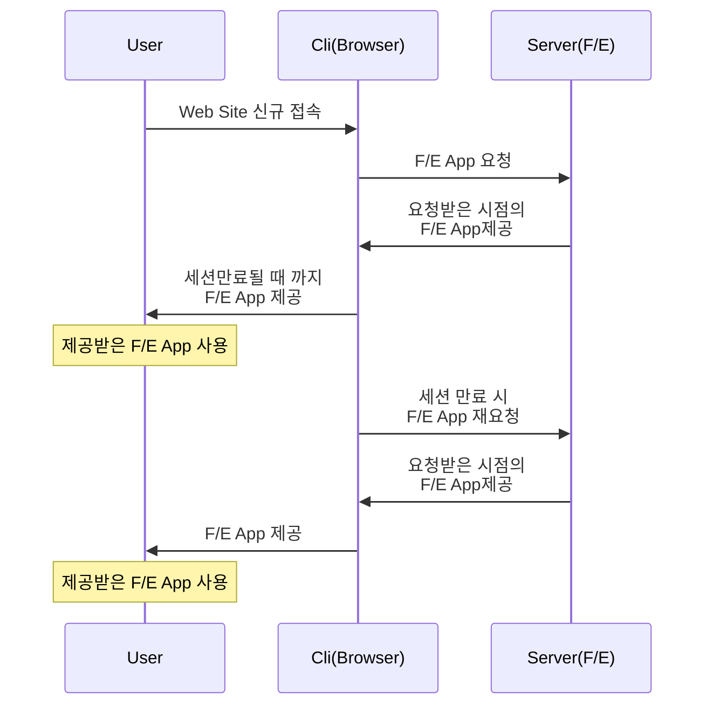
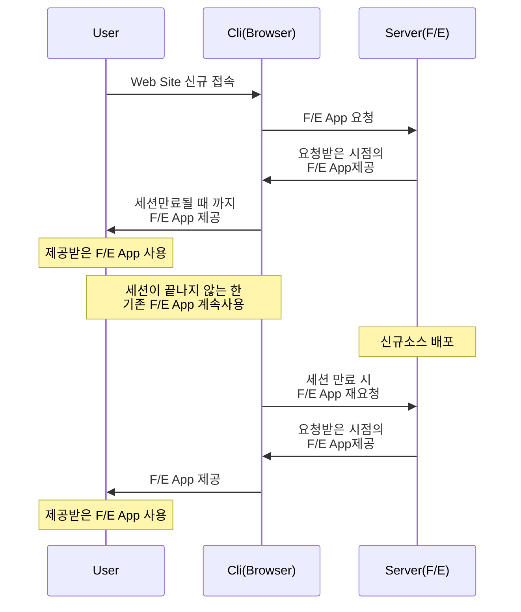
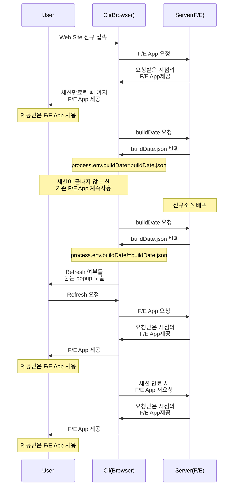

# Issue
사용자가 서비스 사용 중인 상태에서 WebApp(Front Vue App)이 신규 배포되었을 때, 서버에 배포된 따끈따끈한 WebApp과 사용자의 Browser에서 구동중인 WebApp이 서로 다른 버전을 바로보는 Issue가 있었다. 물론 세션이 종료되면 버튼 클릭 등,  백엔드로 요청이 가는 동작이 실행되면 Refresh되긴 하지만 문제는 배포 당일이였다.  
예를 들어 25-03-08 오전 10시에 WebApp을 배포하는 경우, 오전 10시 이전에 이미 WebApp을 구동중이던 사용자는 세션이 종료되지 않는 한 계속해서 이전 배포의 WebApp을 사용하게 된다.  

  
# Constraint
1. Backend의 리소스는 가급적 사용하지 않을 것
2. 사용자가 버전 동기화 여부를 선택할 수 있어야 할 것 (시스템 특성상 한 화면에서 작업을 1시간 넘게 지속하는 CASE 존재)
3. 배포시 별도의 절차가 추가되지 않을 것

  
# Solution
여기서 도출한 결과값은 다음과 같다.
1. 배포 시, Build Date를 `process.env`에 저장
2. 같은 값을 `./public`에 `json`파일로 저장
3. 주기적으로 `${domain}/builddate.json`을 호출
4. browser에서 구동중인 webapp의 `process.env > Build Date`와 3 번에서 return받은 `builddate.json`의 값을 비교하여 두 값이 다른 경우 browser 상의 webapp을 새로고침할지 여부를 묻는 popup 노출

  
# Diagrams
## 신규소스 배포 없는 경우
이미 Browser가 최신 버전의 webapp을 구동중인 경우

  
## 신규소스 배포된 경우
신규 소스가 배포되더라도, 배포되기 전에 구동중인 Webapp을 사용하는 User는 계속해서 구버전을 사용하게 된다. 즉, User는 세션이 만료되어 Browser가 Server 측에 신규 WebApp을 요청하거나 스스로 Refresh하지 않는 한, 이전 버전의 소스로 구동중인 WebApp을 사용하게 된다.

  
## 해결방안 적용
따라서 다음과 같이 Client(Browser)에서 일정 주기로 Frontend Server에 `buildDate`를 요청해서 Client(Browser) 자신의 `process.env`상의 `buildDate`와 비교 후, 서로 다른 경우에 사용자에게 refresh 여부를 묻는 팝업을 노출하도록 하였다. 

  
